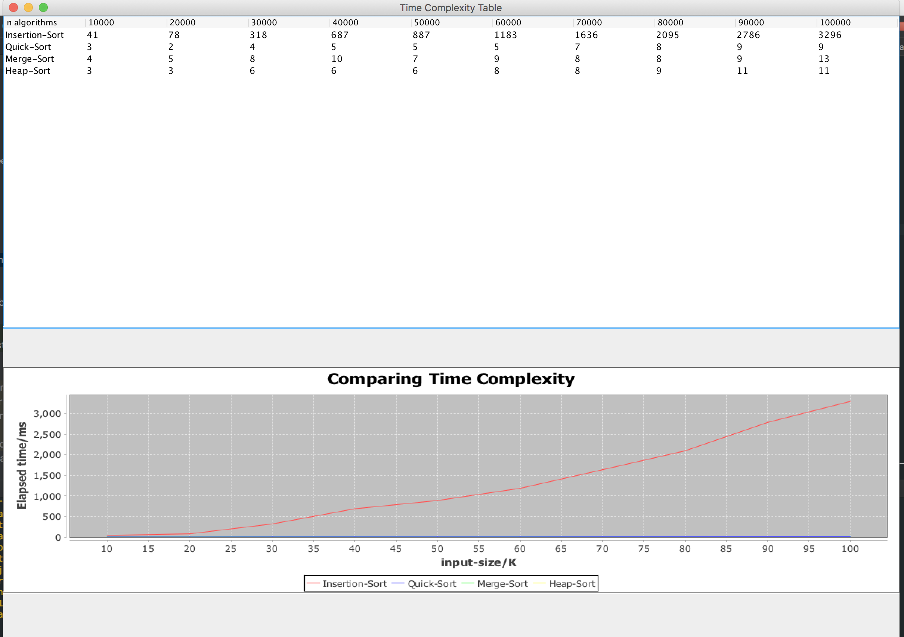

# Compartive document of 4 sorting algorithm

> In this exprienment, we compared 4 sorting algorithm: 
>
> Insertion-sort, Merge-sort, Quick-sort and Heap-sort.
>
> I implemted four sorting algorithms separately, designed a program to compare running time of four algorithm, lastly the comparing result output as a table and XYchart within java GUI library.
>
> Plus, In my program, **We need to add a jar: jfreechart-1.0.19.jar**

## Insertion-sort

The easiest sorting method, normally the running complexity is $O(n^2)$ .

In the experiment, I used two level of loop to implement insertion-sort, and the running time result of this sort method showed above.

---

## Merge-Sort

Merge-sort based on the design pattern *conquer-and-divide*. In the experiment, I implement merge-sort clearly follow the step of : *Divide, Conquer, Combine*.

In this part I write a non-recursive method to implment Merge-sort. To make the implemented method clear, the algorithm divided into 3 part, the first part invoke second part and second part invoke 3rd part.

I set a subarray's length in sort method and then invoke mergePass() to divide array into n/2k segments. In mergePass() method, I invoke merge() method to conquer and combine it.

Through the experiment, the above pic clearly shows that merge sort has a very slow increment as the input size increasing. And the running time proved the time complexity of merge-sort is $O(nlogn)$.

---

## Quick-Sort

This sorting method clearly realize divide and conquer design pattern. In every loop, we set a pivot and exchange position of each integer follow under rules:

1.search from right to left, if left< right, exchange left & right

2.search from left to right, if right < left, exchange right & left

when loop ends, all integer smaller than pivot should stay in right side of pivot, all integer larger than pivot should stay in left side of pivot
then recursive right sub array and left sub array.

We can use a nice and clear recursive method to help us do many things.

The running time result picture clearly proves that the time complexity of Quick-sort is $O(nlogn)$

---

## Heap-Sort

This sorting method need to build a binary tree first, and then extract the max number which is the root of the tree and move it back to array from max to min.

So, the sorting method break into 2 steps:

1. heapify the array
2. Extract root(max number) out of heap, and get the sorted array.

At last, the running time complexity is $O(nlogn)$

---

As the result picture, The quickest method is quick-sort, then heap-sort and merge-sort. Insertion-sort is the slowest sorting method comparing with other three sorting method as the input size increased.